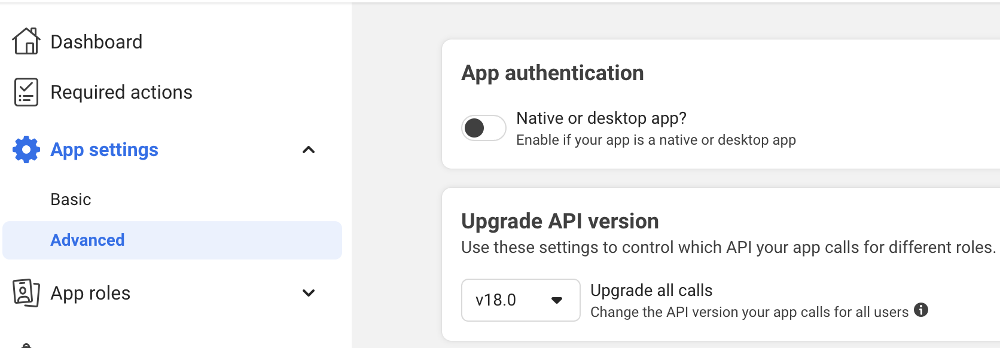

This page includes instructions to create credentials for using the Facebook Marketing API. To use the API, three things are needed:
1. Token
2. Version
3. Creation Act

__Set up app__
1. [Register as Meta Developer](https://developers.facebook.com/docs/development/register/)
2. Go to [https://developers.facebook.com/](https://developers.facebook.com/) and click [My Apps](https://developers.facebook.com/apps/?show_reminder=true)
3. Click [Create App](https://developers.facebook.com/apps/creation/) (green button)
4. Click [Other](https://developers.facebook.com/apps/create/?show_additional_prod_app_info=false&internal_test_app_surface_skipped=false)
5. Click __Business__, then __Next__
6. Create a name for the App, then click __Create App__
7. On the __Add products to your app__ page, click __Set Up__ for __Marketing API__

__Get token__
1. Click __Tools__, which appears on the left hand side under __Marketing API__
2. Under __Select Token Permissions__, click the boxes next to __ads_management__ and __ads_read__
3. Click __Get Token__; the token will appear in gray, and be a long string starting with something like `EEAKW...`

__Get version__
1. Under __App Settings__, click __Advanced__; the version will show on this page---for example, `"v18.0"`

__Get creation act__
1. Go to [https://www.facebook.com/business/](https://www.facebook.com/business/)
2. Click __Create an ad__
3. The creation act will appear in the URL: __https://adsmanager.facebook.com/adsmanager/onboarding?act=[CREATION ACT NUMBER HERE]&breakdown_regrouping=1__

